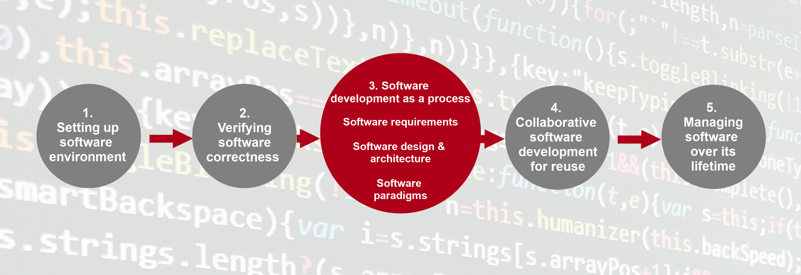

# Section 2


## Write some unit tests
We already have a couple of test cases in `test/test_models.py` that test the `daily_mean()` function. Looking at `inflammation/models.py`, write at least two new test cases that test the `daily_max()` and `daily_min()` functions, adding them to `test/test_models.py`. Here are some hints:

You could choose to format your functions very similarly to `daily_mean()`, defining test input and expected result arrays followed by the equality assertion.
Try to choose cases that are suitably different, and remember that these functions take a 2D array and return a 1D array with each element the result of analysing each column of the data.
Once added, run all the tests again with `pytest tests/test_models.py`, and you should also see your new tests pass.

<details>
<summary>Solution</summary>

```
def test_daily_max():
    """Test that max function works for an array of positive integers."""
    from inflammation.models import daily_max

    test_input = np.array([[4, 2, 5],
                           [1, 6, 2],
                           [4, 1, 9]])
    test_result = np.array([4, 6, 9])

    npt.assert_array_equal(daily_max(test_input), test_result)


def test_daily_min():
    """Test that min function works for an array of positive and negative integers."""
    from inflammation.models import daily_min

    test_input = np.array([[ 4, -2, 5],
                           [ 1, -6, 2],
                           [-4, -1, 9]])
    test_result = np.array([-4, -6, 2])

    npt.assert_array_equal(daily_min(test_input), test_result)
```

</details>

<br>
<br>
<br>
<br>

## Write parameterised unit tests
Rewrite your test functions for daily_max() and daily_min() to be parameterised, adding in new test cases for each of them.

<br>
<br>
<br>
<br>

## YAML

```
name: Kilimanjaro
height_metres: 5892
first_scaled_by: Hans Meyer
```


```
first_scaled_by:
  - Hans Meyer
  - Ludwig Purtscheller
```

```
first_scaled_by: [Hans Meyer, Ludwig Purtscheller]
```

```
height:
  value: 5892
  unit: metres
  measured:
    year: 2008
    by: Kilimanjaro 2008 Precise Height Measurement Expedition
```

```
first_scaled_by:
  - name: Hans Meyer
    date_of_birth: 22-03-1858
    nationality: German
  - name: Ludwig Purtscheller
    date_of_birth: 22-03-1858
    nationality: Austrian
```

<br>
<br>
<br>
<br>

## Exploring tests for edge cases
Think of some more suitable edge cases to test our `patient_normalise()` function and add them to the parametrised tests. After you have finished remember to commit your changes.

<details>
<summary>Solution</summary>

```
@pytest.mark.parametrize(
    "test, expected",
    [
        (
            [[0, 0, 0], [0, 0, 0], [0, 0, 0]],
            [[0, 0, 0], [0, 0, 0], [0, 0, 0]],
        ),
        (
            [[1, 1, 1], [1, 1, 1], [1, 1, 1]],
            [[1, 1, 1], [1, 1, 1], [1, 1, 1]],
        ),
        (
            [[float('nan'), 1, 1], [1, 1, 1], [1, 1, 1]],
            [[0, 1, 1], [1, 1, 1], [1, 1, 1]],
        ),
        (
            [[1, 2, 3], [4, 5, float('nan')], [7, 8, 9]],
            [[0.33, 0.67, 1], [0.8, 1, 0], [0.78, 0.89, 1]],
        ),
        (
            [[-1, 2, 3], [4, 5, 6], [7, 8, 9]],
            [[0, 0.67, 1], [0.67, 0.83, 1], [0.78, 0.89, 1]],
        ),
        (
            [[1, 2, 3], [4, 5, 6], [7, 8, 9]],
            [[0.33, 0.67, 1], [0.67, 0.83, 1], [0.78, 0.89, 1]],
        )
    ])
def test_patient_normalise(test, expected):
    """Test normalisation works for arrays of one and positive integers."""
    from inflammation.models import patient_normalise
    npt.assert_almost_equal(patient_normalise(np.array(test)), np.array(expected), decimal=2)
```

</details>

<br>
<br>
<br>
<br>

## Add a Precondition to Check the Correct Type and Shape of Data
Add preconditions to check that data is an `ndarray` object and that it is of the correct shape. Add corresponding tests to check that the function raises the correct exception. You will find the Python function `isinstance` useful here, as well as the Python exception `TypeError`. Once you are done, commit your new files, and push the new commits to your remote repository on GitHub.

<details>
<summary>Solution</summary>

In inflammation/models.py:

```
def patient_normalise(data):
    """
    Normalise patient data between 0 and 1 of a 2D inflammation data array.

    Any NaN values are ignored, and normalised to 0

    :param data: 2D array of inflammation data
    :type data: ndarray

    """
    if not isinstance(data, np.ndarray):
        raise TypeError('data input should be ndarray')
    if len(data.shape) != 2:
        raise ValueError('inflammation array should be 2-dimensional')
    if np.any(data < 0):
        raise ValueError('inflammation values should be non-negative')
    max = np.nanmax(data, axis=1)
    with np.errstate(invalid='ignore', divide='ignore'):
        normalised = data / max[:, np.newaxis]
    normalised[np.isnan(normalised)] = 0
    return normalised
```

In test/test_models.py:

```
@pytest.mark.parametrize(
    "test, expected, expect_raises",
    [
        ...
        (
            'hello',
            None,
            TypeError,
        ),
        (
            3,
            None,
            TypeError,
        ),
        (
            [[1, 2, 3], [4, 5, 6], [7, 8, 9]],
            [[0.33, 0.67, 1], [0.67, 0.83, 1], [0.78, 0.89, 1]],
            None,
        )
    ])
def test_patient_normalise(test, expected, expect_raises):
    """Test normalisation works for arrays of one and positive integers."""
    from inflammation.models import patient_normalise
    if isinstance(test, list):
        test = np.array(test)
    if expect_raises is not None:
        with pytest.raises(expect_raises):
            npt.assert_almost_equal(patient_normalise(test), np.array(expected), decimal=2)
    else:
        npt.assert_almost_equal(patient_normalise(test), np.array(expected), decimal=2)
```

Note the conversion from `list` to `np.array` has been moved out of the call to `npt.assert_almost_equal()` within the test function, and is now only applied to list items (rather than all items). This allows for greater flexibility with our test inputs, since this wouldn’t work in the test case that uses a string.

</details>

<br>
<br>
<br>
<br>

## Fix code style errors
Rename our local variable `max` to something else (e.g. call it `max_data`), then rerun your tests and commit these latest changes and push them to GitHub using our usual feature branch workflow. Make sure your `develop` and `main` branches are up to date.


<br>
<br>
<br>
<br>

# Section 3


